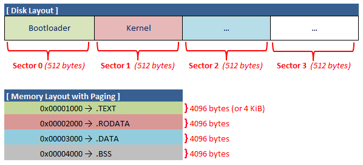

# OS Dev Notes
## Table of Contents
- [Bit & Bytes](#bits-&-bytes)
- [x86 Type & Size](#x86-types-&-size)
- [Global Descriptor Table (GDT)](#global-descriptor-table-(gdt))
- [Enable A20 Line](#enable-a20-line)
- [Cross Compiler](#cross-compiler)
- [A Simple Disk Driver](#A-Simple-Disk-Driver)
- [Addressing Misalignment Issue](#addressing-misalignment-issue)

## Bits & Bytes


---
## x86 Type & Size
| Type| Meaning| Size|
|---|---|---|
| db| Byte| 1 byte (8 bits)|
| dw| Word| 2 bytes (16 bits)|
| dd| Doubleword| 4 bytes (32 bits)|
| dq| Quadword| 8 bytes (64 bits)|

---
## Global Descriptor Table (GDT)
- GDT is a ***blueprint*** that tells the CPU how to configure memory segments before switching to Protected Mode.
- A GDT Entry is 8 bytes long or 64 bits total.
  
    ```
    Segmen Limit + Base + Access Byte + Flags = 64 bits
    ```

### :large_blue_diamond: Bit-by-Bit Layout
<table>
  <tr>
    <th></th>
    <td>LIMIT (Low)</td>
    <td colspan="2">BASE ADDRESS (Low/Middle)</td>
    <td colspan="4">ACCESS BYTE</td>
    <td>LIMIT (High)</td>
    <td colspan="4">FLAGS</td>
    <td>BASE ADDRESS (High)</td>
  </tr>
  <tr>
    <th>Name</th>
    <td>Limit Low</td>
    <td>Base Low</td>
    <td>Base Middle</td>
    <td>Present (P)</td>
    <td>DPL</td>
    <td>Descriptor Type</td>
    <td>Segment Type</td>
    <td>Limit High</td>
    <td>Granularity (G)</td>
    <td>Size (D/B)</td>
    <td>Long Mode (L)</td>
    <td>AVL</td>
    <td>Base High</td>
  </tr>
  <tr>
    <th>Bit Range</th><td>0-15</td><td>16-31</td><td>32-39</td><td>47</td><td>46-45</td><td>44</td><td>43-40</td><td>48-51</td><td>55</td><td>54</td><td>53</td><td>52</td><td>56-63</td>
  </tr>
  <tr>
    <th>Bits (64 total)</th><td>16</td><td>16</td><td>8</td><td colspan="4">8</td><td>4</td><td colspan="4">4</td><td>8</td>
  </tr>
  <tr>
    <th>Byte (8 total)</th><td>0 - 1</td><td>2 - 3</td><td>4</td><td colspan="4">5</td><td>6</td><td colspan="4">7</td><td>8</td>
  </tr>
</table>

---
### :large_blue_diamond: Type of Descriptors
1. Code Segment Descriptor
    - Defines a segment containing executable code
2. Data Segment Descriptor
    - Defines a segment containing data
3. System Segment Descriptor
    - Defines system segments used by the OS

---
### :large_blue_diamond: Segment Limit (20 bits)
- The **Segment Limit** deines the size of the segment (or how far memory can go from the **base address**).
- In GDT, segment limit is 20 bits entry and split into:
    1. Lower 16 bits → LIMIT LOW (bit range: 0-15)
    2. Upper 4 bits → LIMIT HIGH (bit range: 48-51) *This field is combine with FLAGS field and makes up an 8-bit field total*
- How Granularity (G bit) affects Segment Limit?
  - If G = 0: limit is in bytes → max size = ~1 MB
  - If G = 1: limit is in 4 KB block → max size = ~ 4 GB

    Let:
    ```
    Limit = 0xFFFF ; 20-bit max
    G = 1          ; Granularity = 4KB
    ```

    Then:
    ```
    Effective Segment Size = (Limit + 1) x 4KB
                           = (0xFFFF + 1) x 4KB
                           = 4 GB
    ```

---
### :large_blue_diamond: Base Address (32 bits)
- The **Base Address** tells the CPU where the segment begins in linear memory.
- In GDT, base address is a 32-bit entry and split into:
  1. Lower 16 bits → BASE LOW (bit range: 16-31) *A lower 2 bytes of a 32-bit address*
  2. Middle 8 bits → BASE MIDDLE (bit range: 32-39) *Next byte of the address*
  3. Upper 8 bits → BASE HIGH (bit range: 56-63) *Final byte of the address*
- Together, they form a full 32-bit linear address of the segment's starting point.

---
### :large_blue_diamond: Access Byte (8 bits)
- The **Access Byte** defines:
  - Whether segment is **present (Present - P)**
  - Its **privilege level (Descriptor Privilege Level - DPL)**
  - If it is **Code/Data or System segment (Descriptor Type - S)**
  - What kind of operations are allowed: **Read, Write, Execute (Segment Type - T)**
- Access Byte breakdown:

  | Bit Range| Name| Description| Bit|
  |---|---|---|---|
  | 47| Present (P)| Set to **1** if the segment is valid and present in memory| 1|
  | 46-48| DPL| 2-bit value: **00** = Ring 0, **11** = Ring 3| 2|
  | 44| Descriptor Type (S)| **1** = Code/Data segment, **0** = System segment| 1|
  | 43-40| Segment Type (T)| Varies by segment (Read/Write/Execute flags)| 4|

 - Bit-Level view:

   | Bit| 7| 6| 5| 4| 3| 2| 1| 0|
   |---|---|---|---|---|---|---|---|---|
   | Field| P| DPL1| DPL0| S| T3| T2| T1| T0|

- Common Access Byte setting:

  | Segment| Binary| Hex| Meaning|
  |---|---|---|---|
  | Code (RX, Ring 0)| 10011010| 0x9A| Present, DPL = 0, Readable-Executable|
  | Data (RW, Ring 0)| 10010010| 0x92| Present, DPL = 0, Readable-Writable|
  | Code (RX, Ring 3)| 11111010| 0xFA| Present, DPL = 3, Readable-Executable|
  | Data (RW, Ring 3)| 11110010| 0xF2| Present, DPL = 3, Readable-Writable|

---
#### :small_orange_diamond: Descriptor Privilege Level (DPL)
- DPL is a 2-bit field inside a GDT entry which defines who is allowed to access a particular segment.
- DPL is part of the Access Byte, which is 5th byte (byte 5) in GDT entry (see GDT Entry Layout)

  | DPL Value| Privilege Level| Meaning|
  | ---| ---| ---|
  | 0 (Highest Priv.)| Ring 0| Kernel/OS|
  | 1| Ring 1| Rarely used|
  | 2| Ring 2| Rarely used|
  | 3 (Least Priv.)| Ring 3| User Applications|

- How DPL Work?
  - When a program tries to use a segment, the CPU checks:
    1. Current CPL: Current Privilege Level (stored in CS register's low 2 bits)
    2. DPL: Targer Segment's Descriptor Privilege Level (Target DPL)
    3. RPL: Requestor Privilege Level (low 2 bits of the selector)
  - The CPU compares CPL, DPL, and RPL to decide if access is allowed:
    - If not → General Protection Fault.

---
### :large_blue_diamond: FLAGS (4 bits) or Limit High + FLAGS (8 bits)

---
## Global Descriptor Table Register (GDTR)
- **Global Descriptor Table Register (GDTR)** is a special CPU register that stores:
  - The **base address** of the Global Descriptor Table (GDT)
  - The size (limit) of the GDT in bytes (minus 1)

### :large_blue_diamond: Purpose of GDTR
- When switching to Protected Mode, the CPU needs to know:
  - Where the GDT is in memory
  - How big it is so the CPU can look up **segment descriptor** (for code, data, stack, etc)

→ The GDTR tells the CPU where to find GDT 

### :large_blue_diamond: GDTR Structure (6 bytes total)

| Bytes| Field| Description|
|---|---|---|
| 0-1| Limit| Size of GDT in bytes - 1 (max 65535)|
| 2-5| Base| 32-bit linear address of the GDT|

### :large_blue_diamond: Load GDTR in NASM

```Assembly
lgdt [gdt] ; load [gtd] to the GDTR CPU register

gdt:
  dw gtd_end - gdt_start - 1 ; size / limit of the GDT
  dd gtd_start ; Base address of the GDT
```

---
## Enable A20 Line

- The **A20 Line** is the 21st address line on x86 CPUs which allows access to memory above 1 MB (0xFFFFF).

- Why was A20 originally disabled?
  - For backward compatibility with Real Mode software, A20 line was disabled originally.

- Why enable A20 in Protected Mode?
  - Protected Mode requires access to memory above 1 MB → A20 line must be enabled.
  - Allows CPU to use linear addresses beyond 1 MB (0x00100000 (1MB+) and beyond).

```Assembly
; Source: https://wiki.osdev.org/A20_Line#Fast_A20_Gate
; Modified by ttran.tech
; Test A20 and set if A20 does not set.
[bits 32]

start_protected_mode:
	jmp is_A20_on? ; test for A20 line when starting Protected Mode

enable_A20:	; enable A20 if A20 line is cleared
	in al, 0x92
	or al, 2
	out 0x92, al
	jmp is_A20_on? ; re-test A20 line

is_A20_on?:
	pushad
	mov edi,0x112345  ;odd megabyte address.
	mov esi,0x012345  ;even megabyte address.
	mov [esi],esi     ;making sure that both addresses contain diffrent values.
	mov [edi],edi     ;(if A20 line is cleared the two pointers would point to the address 0x012345 that would contain 0x112345 (edi)) 
	cmpsd             ;compare addresses to see if the're equivalent.
	popad
	jne A20_on        ;if not equivalent , A20 line is set.
	jmp enable_A20    ;if equivalent, the A20 line is cleared, jmp to enable_A20.
	
A20_on:
	; do others task here
```
---
## Cross Compiler
- A **Cross Compiler** is configured to generate code for a barebones system without linking to any standard libraries like *glibc* or make any system calls that the kernel doesn't yet support.

Downloads:

binutils-2.35: https://ftp.gnu.org/gnu/binutils/

gcc-10.2.0: https://ftp.lip6.fr/pub/gcc/releases/gcc-10.2.0/

```
sudo apt install build-essential
sudo apt install bison
sudo apt install flex
sudo apt install libgmp3-dev
sudo apt install libmpc-dev
sudo apt install libmpfr-dev
sudo apt-get install libmpc-dev
sudo apt install texinfo
sudo apt install libcloog-isl-dev
sudo apt install libisl-dev 

###### Install binutils #######################################################
export PREFIX="$HOME/opt/cross"
export TARGET=i686-elf
export PATH="$PREFIX/bin:$PATH"

cd $HOME/src

mkdir build-binutils
cd build-binutils
../binutils-2.35/configure --target=$TARGET --prefix="$PREFIX" --with-sysroot --disable-nls --disable-werror
make
make install

###### Install GCC #######################################################

export PREFIX="$HOME/opt/cross"
export TARGET=i686-elf
export PATH="$PREFIX/bin:$PATH"

cd $HOME/src

# The $PREFIX/bin dir _must_ be in the PATH. We did that above.
which -- $TARGET-as || echo $TARGET-as is not in the PATH

mkdir build-gcc
cd build-gcc
../gcc-10.2.0/configure --target=$TARGET --prefix="$PREFIX" --disable-nls --enable-languages=c,c++ --without-headers --disable-hosted-libstdcxx
make all-gcc
make all-target-libgcc
make all-target-libstdc++-v3
make install-gcc
make install-target-libgcc
make install-target-libstdc++-v3
```

## A Simple Disk Driver
- The purpose of this driver is to provide a way for the bootloader to load kernel code into memory; hence, transferring the control to the kernel.

#### Build Script (build.sh)
- This script sets up the PATH to the cross compiler. 
- Allows the Makefile to locate and execute GCC Cross Compiler instead of the system compiler.

```
#/bin/bash
export PREFIX="$HOME/opt/cross"
export TARGET=i686-elf
export PATH="$PREFIX/bin:$PATH"
make all
```

#### Makefile Config
```
# Defines a variables FILES containing the objects files to be linked
# together to form the kernel binary.
FILES = ./build/kernel.asm.o

###############################################################################
# Syntax
# Target: Dependency_1 Dependency_2
#	Command_1
#	Command_2
###############################################################################

# Build all target
all: ./bin/boot.bin ./bin/kernel.bin
# Remove old os.bin, -rf recursive and force to remove all files and directories
	rm -rf ./bin/os.bin
# Concatenate *.bin files into a single os.bin in sector order:
# 	Sector 0: boot.bin
# 	Sector 1: kernel.bin
# if: input file
	dd if=./bin/boot.bin >> ./bin/os.bin
	dd if=./bin/kernel.bin >> ./bin/os.bin
# Padding the rest of the file with zeros in multiple of 512 (block size * # of empty sectors).
# bs = block size.
# count = # of empty sectors.
	dd if=/dev/zero bs=512 count=100 >> ./bin/os.bin

# Build the kernel sector binary.
./bin/kernel.bin: $(FILES)
# i686-elf-ld: link the object files (*.o) into a single object file.
# -g: enable debugging information.
# -relocatable: tells the linnker to create a relocatable output.
#				the object files can be used as input to the linker again.
# kernelfull.o: contains all the code that will be in the final kernel binary
	i686-elf-ld -g -relocatable $(FILES) -o ./build/kernelfull.o
# i686-elf-gcc: link the object files into a binary using the linker script (-T <path to linker script>).
# -ffreestanding: freestanding code (not hosted by an OS).
# -O0: no optimize.
# -nostdlib: no link to standard libraries.
	i686-elf-gcc -T ./scr/linker.ld -o ./bin/kernel.bin -ffreestanding -O0 -nostdlib ./build/kernelfull.o

# Build the boot sector binary
./bin/boot.bin: ./src/boot/boot.asm
	nasm -f bin ./src/boot/boot.asm -o ./bin/boot.bin

# Assemble the kernel.asm into an object file
./build/kernel.asm.o: ./src/kernel.asm
# -f elf: tells NASM to ouput in the ELF format (Executable and Linkable Format)
	nasm -f elf -g ./src/kernel.asm -o ./build/kernel.asm.o

# clean up build
clean:
	rm -rf ./bin/boot.bin

# run
run:
	qemu-system-x86_64 -hda ./bin/boot.bin

# run qemu with remote dbg
run-remote:
	qemu-system-x86_64 -s -S -hda boot.bin
```


#### Linker Script
```
/* 
 * Linker Script for Kernel Debugging
 * ----------------------------------
 * This script defines how the linker should arrange the kernel binary in memory.
 * It ensures proper memory layout and symbol resolution, enabling us to debug 
 * the kernel with tools like GDB using named symbols (e.g., "break kernel_start")
 * instead of raw memory addresses.
 */
ENTRY(_start) /* Signifies the starting point of the execution in the kernel */
OUTPUT_FORMAT(binary) /* Sets the output format */
SECTIONS /* Defines memory layout of the output */
{
    . = 1M; /* Sets the start of the section at 1MB mark (match the kernel load address) */
    .text : /* Program code */
    {   /* Tells the linker to take all .text sections from the input files and put them into the .text section of the output file */
        *(.text) 
    }

    .rodata : /* Read-only data */
    {
        *(.rodata)
    }

    .data : /* Initialized data */
    {
        *(.data)
    }

    .bss : /* Unintialized data */
    {
        *(COMMON)
        *(.bss)
    }
}
```

#### Disk Driver Source Code

```Assembly
load_kernel:
    ; LBA number sectors:
    ;   0: bootloader
    ;   1: second sector
    mov eax, 1          ; load LBA number sector into EAX (second sector - kernel code)
    mov ecx, 100        ; total sectors to read, bytes = 512 * 100 = 51,200 bytes loaded
    mov edi, 0x0100000  ; the address in memory to load the sectors into
    call ata_lba_read
    ; Once the sectors loaded, jump to where the kernel was loaded
    ; and execute the kernel.asm file.
    ; CODE_SEG ensures the CS register becomes the code selector specified in the GDT
    ; enforcing the GDT code rules for execution.
    jmp CODE_SEG:0x0100000

ata_lba_read:
    mov ebx, eax    ; backup the LBA
    ; Send the hightest 8 bits of the LBA to hard disk controller
    shr eax, 24     ; EAX = 0000 0000 0000 0000
    ;
    ; Control Bit (0xE0/0xF0)
    ; 0xE0 (1110 0000): Master drive
    ; 0xF0 (1111 0000): Slave drive
    ;
    ; Bit:  7 6 5 4 3 2 1 0
    ;       1 1 1 0 0 0 0 0
    ;       V v V V \_____/   
    ;       │ │ │ │   │
    ;       │ │ │ │   │ 
    ;       │ │ │ │   │
    ;       │ │ │ │   └─ bits 24-27 of the block number (LBA addressing) (bit 0-3)
    ;       │ │ │ │
    ;       │ │ │ └─ Drive select: 1 = master, 0 = slave (bit 4)
    ;       │ │ └─ Always set 1 (bit 5)
    ;       │ └─ LBA mode: 0 = CHS Addressing, 1 = LBA Addressing (bit 6)
    ;       └─ Always set 1 (bit 7)
    ;
    or eax, 0xE0    ; set control bits (select Master drive) | EAX = 0000 0000 0000 0000 1110 0000
    mov dx, 0x1F6   ; sets dx to port 0x1F6 (Drive/Head register)
    out dx, al      ; sends request (control bytes) to Drive/Head register (port 0x1F6)

    ; Send the total sectors to read to port 0x1F2
    mov eax, ecx
    mov dx, 0x1F2   ; load port number
    out dx, al      ; send request to port

    ; *** SEND LBA BYTE TO DISK CONTROL BOARD ***
    ; Send LBA Low Byte (bit 0-7) to port 0x1F3
    mov eax, ebx    ; restore the backup LBA
    mov dx, 0x1F3   ; load port number
    out dx, al      ; send request to port

    ; Send LBA Mid Byte (bit 8-15) to port 0x1F4
    mov eax, ebx    ; restore the back LBA
    shr eax, 8
    mov dx, 0x1F4   ; load port number
    out dx, al      ; send request to port

    ; Send LBA High Byte (bit 16-23) to port 0x1F5
    mov eax, ebx
    shr eax, 16
    mov dx, 0x1F5   ; load port number
    out dx, al      ; send request to port
    ; *** FINISH SEND LBA BYTE ***

    ; Send READ command to port 0x1F7
    mov al, 0x20
    mov dx, 0x1F7   ; load port number
    out dx, al      ; send request to port

    ; Read all sectors into memory
.next_sector:
    push ecx

    ; Check for READ status from disk
.try_again:
    mov dx, 0x1F7
    in al, dx
    test al, 8
    jz .try_again

    ; Read 256 words (512 bytes) at a time
    mov ecx, 256
    mov edx, 0x1F0
    rep insw
    pop ecx
    loop .next_sector
    ret
```
## Addressing Misalignment Issue
### :large_blue_diamond: Overview
- **Alignment** refers to place data or code at memory address that are multiples of a specific boundary size, such as 16 bytes, 512 bytes, or 4096 bytes (4 KiB).

### :large_blue_diamond: Why Alignment Matters
1. Memory/Page Alignment (4096 bytes)
	- x86 architechture uses 4 KiB boundaries can:
 		- Break paging setup (e.g., page table misbehavior).
   		- Lead to page faults, incorrect memory access, or inefficient memory usage.
		- Prevent clean separation of `.text`, `.data`, `.bss` sections.
	- Real Impact:
        - Kernel crashes during boot.
        - Page table misconfiguration or access violation.
        - Performance issue from unaligned memory.

2. Disk Sector Alignment (512 bytes) 
    - BIO and ATA read data in 512-bytes sectors.
    - If bootloader or kernel binary is not padded to 512 bytes:
        - BIOS may read garbage data.
        - Kernel may load improperly.
        - Could corrupt control flow or crash during boot.
    - Real Impact:
        - Boot failure.
        - Incorrect data loaded into memory.
        - Kernel loaded with wrong offset or missing instructions.
     
### :large_blue_diamond: Solutions
#### A. Memory Alignment via Linker Script
-  Add `ALIGN(4096)` to each section:
```
.text ALIGN(4096) :
{
    *(.text)
}

.data ALIGN(4096) :
{
    *(.data)
}
```
- This helps to ensure:
    - Sections start at a page boundary.
    - Compatible with paging and virtual memory.
    - Clean memory layout.

#### B. DisK Sector Alignment via Assembly Padding
- Add padding at the end of a binary section:
```
times 512 - ($ - $$) db 0

$ = current location
$$ = start of section
db 0 = Padding the sector with exactly 512 bytes
```
- This helps to ensure:
    - BIO reads a complete sector (512 bytes).
    - Bootloader/Kernel is not partially loaded or misaligned.
 
### :large_blue_diamond: Visualize



---
## Interrupt Descriptor Table (IDT)
### :large_blue_diamond: What is the IDT?
- The IDT is a table in memory that defines how the CPU should handle interrupts, exceptions, and hardware interrupts.

- It tells the CPU what interrupt service routine (ISR) to call when an interrupt or exception occurs.

### :large_blue_diamond: Why Is the IDT Essential in OS Development?
- Interrupt Handling:
  - The IDT is used by the CPU to dispatch interrupts, which are essential for handling things like timer ticks, keyboard input, and exceptions (e.g., divide-by-zero).

- System Stability:
  - Without a proper IDT, the OS cannot properly manage or recover from hardware and software faults.

- Control Flow:
  - Setting an IDT is a prerequisite for implementing multitasking and other advanced OS features.

### :large_blue_diamond: IDT Entry Structure (for 32-bit Protected Mode)
- Each entry in the IDT is 8-bytes long

| Field | Size (Bits) | Description |
|---|---|---|
| Offset Low | 16 | Lower 16 bits of the ISR address |
| Selector | 16 | Code Segment Selector (from GDT) |
| Reserved | 8 | Usually zero |
| Type/Attribute | 8 | Gate Type, DPL, Present Flag, etc. |
| Offset High | 16 | Upper 16 bits of the ISR address |

- Fields in Type/Attribute Byte:

| Bits | Size (Bits) |Type/Attribute | Description |
|---|---|---|---|
| 7 | 1 |P (Present) | Must be set to 1 if the descriptor is valid. |
| 6-5 | 2 | DPL (Descriptor Privilege Level) | Indicates the minimum privilege level required to invoke this interrupt (0: kernel, 3: user-mode).|
| 4 | 1 | S (Storage Segment) | Always 0 for system segments like interrupt gates.
| 3-0 | 4 | Gate Type | Indicates the type of gate:<br> <ul><li>`0xE` (14, binary `1110`) for a 32-bit interrupt gate (most common)</li><li>`0xF` (15, binary `1111`) for a 32-bit trap gate (similar to an interrupt gate but does not clear the interrupt flag on entry).</li></ul>|


- Example for an interrupt gate with Type/Attr of `0x8E` (1000 11110):
  - P = 1
  - DPL = 00
  - S = 0
  - Type = 1110 (0xE)

### :large_blue_diamond: How the CPU Uses the IDT?
1. Loading the IDT:
    - The CPU uses a special register called the IDTR (Interrupt Descriptor Table Regiser).
      - You set up your IDT in memory and load the IDT's base address and limit into the IDTR using `lidt` instruction.
      - The structure of the IDTR is similar to the GDTR:

      ```Assembly
      ; define the IDT limit and base address
      idt:
        dw idt_size - 1 ; Limit: size of the IDT - 1
        dd idt_base     ; Base Address: the starting address of the IDT

      ; load the IDT into CPU register (IDTR)
      lidt [idt]
      ```
2. Interrupt Processing:
    - When the interrupt occurs, the CPU does the following tasks:
      - Use the interrupt vector (a number between 0 and 255) as an index into the IDT.
      - Retrieves the corresponding 8-byte entry from the IDT.
      - Extract the ISR address by combining the Offset Low and Offset High.
      - Loads the code segment from the Selector field.
      - Jumps to that ISR with the appropriate privilege level based on the Type/Attr field.

### :star: Further Explain:
**1. What is the ISR?**
- ISR (Interrupt Service Routine) is the routine (or function) that the CPU jumps to when a specific interrupt occurs.
- Purpose:
  - Handle the interrupt or exception (timeer tick, keyboard input, or a fault like division-by-zero).
- Location:
  - The ISR code is placed in memory, either written in assembly or C (with assembly wrappers).

**- How the ISR Fits in:**
- The IDT entry for an interrupt contains the address of the ISR (Offset Low/Offset High) and a Selector that tells the CPU which code segment (defined in the GDT) the ISR lives in.

**2. How the CPU Uses the IDT to Call an ISR**

When an interrupt occurs, the CPU does the following:

  - **2.1 Interrupt Vector Index:** (Defined by developer when creating/declaring the IDT entry)
    - It uses the interrupt number (0 to 255) as an index into the IDT to retrieve the corresponding entry.
  
  - **2.2 The IDT Entry Contains:** *(Defined by developer in either C or Assembly).*
    - **Offset Low (16 bits)**: Lower part of the ISR address.
    - **Selector (16 bits)**: Points to a code segment descriptor in the GDT.
    - **Reserved (8 bits)**: Always zero.
    - **Type/Attributes (8 bits)**: Contains the gate type (e.g., interrupt gate), privilege level (DPL), and a present bit.
    - **Offset High (16 bits)**: Upper part of the ISR address.

  - **2.3 Find ISR Address:**
    - **Selector:**
      - The CPU takes the selector from the IDT entry and uses it to find the corresponding code segment descriptor in the **GDT** *(defined before switching to Protected Mode)*.
      - That descriptor provides the **base address** of the **code segment**.

    - **Offset (Low & High):**
      - The CPU combines the segment's base address with the offset (from the IDT entry) to compute the linear address of the ISR.

  - **2.4 State Saving:**
    - Before transferring control, the CPU typically pushes the current state (registers, flags, etc.) onto the stack.
  
  - **2.5 Jumping to the ISR:**
    - The CPU performs a far jump, updating CS (Code Segment Register) with the selector (Code Segment Based Address) and IP/EIP with the offset from the IDT entry.
    - **Then:** It starts executing the ISR code at that calculated address.

**3. What Happens Once the CPU Jumps to the ISR?**
- **Execute ISR Code:**
  - Once the CPU jumps to the ISR, it executes the insructions in that routine.
  - The ISR will:
    - Perform the necessary operations to handle the interrupt.
    - Usually communicate with hardware (if needed), clear the interrupt, or process error conditions.

  - Example Tasks:
    - Read input from a keyboard buffer.
    - Processing a timer tick.
    - Handling a fault or execption.

- **Returning from the ISR:**
  - At the end of the ISR, the code executes an **IRET instruction** (Interrupt Return).
  - **IRET** pops the previously saved registers (like CS, IP, or EFLAGS) from the stack, restoring the state to resume the interrupted task.

### :star: Side Notes:
- The selector from the IDT is not the segment base, it's an index into the GDT.
- Formular to convert from IDT Selector to GDT Index:
```
GDT Index = IDT Selector >> 3
```

| GDT Index | IDT Selector | Segment Type |
|---|---|---|
| 0 | 0x00 | Null |
| 1 | 0x08 | Code Segment |
| 2 | 0x10 | Data Segment|

- Selector Format:

| Bits | Name |
|---|---|
|15-3 | Index into GDT or LGT |
|2 | TI (Table Indicator), 0 = GTD, 1 = LDT |
|1-0| RPL (Requested Privilege Level) |
